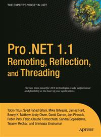

# Apress Source Code

This repository accompanies [*Pro .NET 1.1 Remoting, Reflection, and Threading*](http://www.apress.com/9781590594520) by Syed Fahad Gilani, Jonathan Pinnock, James Hart, Benny K. Mathew, Geir Olsen, Robin Pars, Fabio Claudio Ferracchiati, Tobin Titus, Tejaswi Redkar, Srinivasa Sivakumar, Sandra Gopikrishna, David Curran, and Mike Gillespie (Apress, 2005).

Download the files as a zip using the green button, or clone the repository to your machine using Git.

## Releases

Release v1.0 corresponds to the code in the published book, without corrections or updates.

## Contributions

See the file Contributing.md for more information on how you can contribute to this repository.
